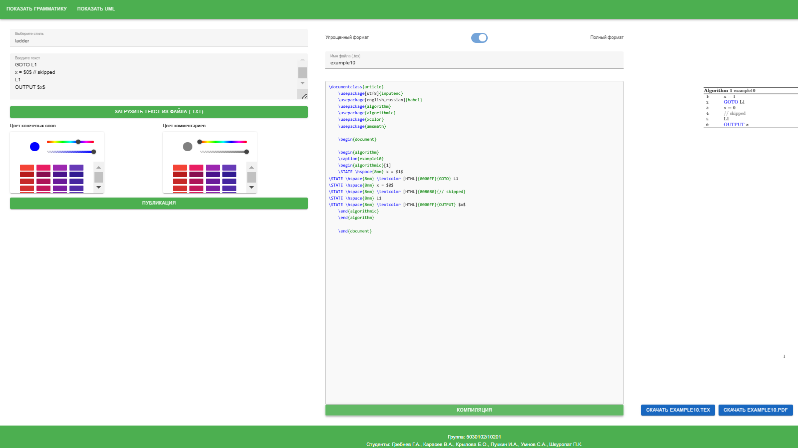

# ПСЕВДОКОД. Публикация

**PSEKO** - это инструмент для форматирования и компиляции кода предметно-ориентированного языка (DSL) в документы LaTeX. Он предоставляет серверную часть, написанную на FastAPI, и клиентскую часть с интерфейсом на Vue.js. Проект позволяет преобразовывать код DSL в структурированный LaTeX и компилировать его в PDF-файлы.

---

## Содержание

- [Особенности](#особенности)
- [Установка](#установка)
- [Запуск приложения](#запуск-приложения)
  - [Использование скрипта](#использование-скрипта)
  - [Ручной запуск](#ручной-запуск)
- [API-эндпоинты](#api-эндпоинты)
- [Примеры работы](#примеры)
- [Авторы](#авторы)

---

## Особенности

- **Парсинг и форматирование DSL**: Преобразует код DSL в структурированный формат LaTeX.
- **Компиляция LaTeX**: Компилирует LaTeX-код в PDF-файлы.
- **Веб-интерфейс**: Предоставляет удобный интерфейс на Vue.js для взаимодействия с серверной частью.
- **Кроссплатформенность**: Работает на Windows, macOS и Linux.

---

## Установка

1. Клонируйте репозиторий:
   ```bash
   git clone https://github.com/Deforc/PSEKO.git
   cd PSEKO
   ```
2. Установите зависимости для серверной части:
Перейдите в корневую директорию и установите Python-зависимости:

   ```bash
   pip install -r requirements.txt
   ```
3. Установите зависимости для клиентской части:
Перейдите в папку GUI/frontend и установите npm-пакеты:
    ```bash
    cd GUI/frontend
    npm install
    ```
---

## Запуск приложения
### Использование скрипта

Проект включает удобный Bash-скрипт (run_app.sh), который запускает серверную и клиентскую части одновременно. Выполните следующие шаги:

1. Сделайте скрипт исполняемым (если он еще не является таковым):
    ```bash
    chmod +x run_servers.sh
    ```
2. Запустите скрипт:
    ```bash
    ./run_servers.sh
    ```
3. Что происходит дальше?

 - Серверная часть запускается на http://127.0.0.1:8000.
 - Клиентская часть запускается на http://localhost:5173 и автоматически открывается в браузере.
 - Нажмите Ctrl+C, чтобы остановить оба сервера.
   
> **Примечание**: Если вы используете Windows без WSL, вы можете использовать Git Bash для запуска скрипта.

---
### Ручной запуск
Если вы предпочитаете запускать серверы вручную:
1. Запустите серверную часть:
    ```bash
    uvicorn GUI.backend.server:app --reload
    ```
2. Запустите клиентскую часть:
    ```bash
    cd GUI/frontend
    npm run dev
    ```
3. Откройте http://localhost:5173 в браузере, чтобы получить доступ к интерфейсу.

---

## API-документация
Проект предоставляет автоматически сгенерированную документацию для всех доступных API-эндпоинтов.

После запуска сервера откройте в браузере:
```
http://127.0.0.1:8000/docs
```

---

## Примеры


## Авторы

- [@Deforc](https://github.com/Deforc)
- [@Brendow271](https://github.com/Brendow271)
- [@vainmoon](https://github.com/vainmoon)
- [@slavikfish03](https://github.com/slavikfish03)
- [@PENDOSOS](https://github.com/PENDOSOS)
- [@ekaterinakrylovao](https://github.com/ekaterinakrylovao)